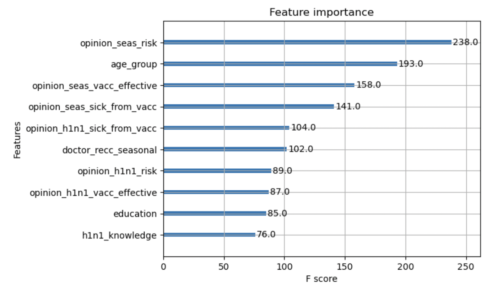

# Seasonal Flu Vaccine Model


# Business Understanding

According to the [World Health Organization](https://www.who.int/teams/immunization-vaccines-and-biologicals/essential-programme-on-immunization/implementation/global-routine-immunization-strategies-and-practices-(grisp)#:~:text=Immunizations%20are%20among%20the%20most,deaths%20and%20disease%20prevalence%20radically), "Immunizations are among the most successful and cost-effective health interventions ever devised."

Immunization is an important factor not only in preventing infectious diseases in individuals, but also in promoting overall public health, as herd immunity can prevent dangerous viral mutations, keep healthcare systems from becoming overwhelmed, and protect the most vulnerable members of our population (including young children, elderly people, and individuals with impaired immunity).


This model is designed to predict the likelihood that an individual receives his or her seasonal flu vaccine. 

Hypothetically, this model could be used to predict the specific probability of a certain individual (or group of individuals) to be vaccinated for the flu. However, for practical purposes, it is unlikely that a healthcare provider would have information on all 35 features that are included in the dataset used for this model. 

**Instead, this model will be used to identify features that are the strongest predictors of vaccination status for the seasonal flu. Healthcare providers can use this knowledge to identify individuals who are unlikely to get vaccinated and provide appropriate interventions in order to improve vaccination rates.**


# Data Understanding

The dataset used for this analysis contains the responses of 26,707 individuals to the [National 2009 H1N1 Flu Survey](./survey.pdf), which was produced by the Centers for Disease Control and Prevention, the National Center for Immunization and Respiratory Diseases, and the National Center for Health Statistics. This survey is conducted via telephone and responses are anonymous.

### Features

The features include individuals' behavior, demographics, and opinions/knowledge. They are outlined in full in the [Jupyter Notebook](./notebook.ipynb).

**Behavioral Features:** For example, whether or not the individual frequently washes hands or uses hand sanitizer.

**Demographic Features:** For example, the individual's age, education, race, and sex.

**Opinion/Knowledge Features:** For example, the individual's opinion about the effectiveness of the seasonal flu vaccine.

**Healthcare Features:** For example, whether the individual's doctor recommended the seasonal flu vaccine.

Most features are binary, but some use rating scales or categorical responses. 

Additional discussion of the distribution of these features and handling of missing data is included in the sections below and in the [Jupyter Notebook](./notebook.ipynb).

### Target Variable

The target variable is a binary variable that indicates whether an individual did (1) or did not (0) receive their seasonal flu vaccine.


# Missing Data

Significant amounts of data were missing from certain features for this dataset. In order to determine the best approach for handling missing data, I preprocessed the data in two different ways and ran generic models on each. Then, I opted to use the preprocessing strategy that resulted in the highest-performing baseline model.

### Preparation strategy #1: Fill missing values with a unique value and one-hot encode.
* **Advangate**: No noise is added to the dataset.
* **Disadvantage**: Information from features with ordinal values is lost.

To implement this strategy, I:
* Imputed missing values with the string "Missing"
* One-hot encoded all columns


### Preparation strategy #2: Fill missing values with the mean/mode value and include an indicator column.
* **Advangate**: No information from features with ordinal values is lost.
* **Disadvantage**: Noise is added to the dataset.

To implement this strategy, I:
* Mapped numerical values to feature values with ordinal values
* Added an indicator column to indicate whether data was missing originally
* Imputed missing values using the mean (for numeric columns) and most frequent value (for categorical columns)
* One-hot encoded categorical columns
* Scaled numeric columns
* Concatenated numeric and categorical columns


# Baseline Models

10 baseline/generic models were created using each of the preprocessing techniques above. These models included:

* Baseline Logistic Regression
* GridSearch Logistic Regression
* Baseline Decision Tree
* GridSearch Decision Tree
* Baseline KNN
* GridSearch KNN
* Baseline Random Forest
* GridSearch Random Forest
* Baseline XGBoost
* GridSearch XGBoost

The model with the highest overall accuracy was the GridSearch XGBoost Model using data prepared according to the second preprocessing technique.

# Best Model

Overall, the best-performing model was the XGBoost Classifier that was fitted using GridSearchCV and data that was processed using the second preparation strategy.

This model has an accuracy score of approximately 79.6%, meaning that its predictions are correct 79.6% of the time.

However, in this model, accuracy is not the most important metric, and in fact, the target class is not even the class that we are most concerned with - it is more beneficial to identify individuals who did not get their seasonal flu vaccine (that is, those with a target value of 0) than those who did get their seasonal flu vaccine.


It would be better to assume that a person has not gotten their seasonal flu vaccine when they actually have (false positive) than assuming that a person has gotten their seasonal flu vaccine when they actually have not (false negative).

Therefore, we want to prioritize the recall score for the target value of 0.


Currently, the model has a recall score of 81.8%. That is, the model correctly identifies 81.8% of individuals that have not gotten their seasonal flu vaccine.

In tuning the model, the scoring parameter will be adjusted to prioritize recall score for the target value of 0 rather than overall accuracy.


## Tuning

Despite multiple attempts, hyperparameter tuning did not result in improvements in model recall.

The model with the highest recall had the following hyperparameters:
* learning_rate: 0.075
* max_depth: 4
* n_estimators: 200


## Feature Importances



The 10 most important features (including their [descriptions](https://www.drivendata.org/competitions/66/flu-shot-learning/page/211/) from the dataset) are: 
* opinion_seas_risk - Respondent's opinion about risk of getting sick with seasonal flu without vaccine
* age_group - Age group of respondent
* opinion_seas_vacc_effective - Respondent's opinion about seasonal flu vaccine effectiveness
* opinion_seas_sick_from_vacc - Respondent's worry of getting sick from taking seasonal flu vaccine
* doctor_recc_seasonal - Seasonal flu vaccine was recommended by doctor
* health_insurance - Has health insurance
* employment_industry - Type of industry respondent is employed in (values represented as short random character strings)
* opinion_h1n1_sick_from_vacc - Respondent's worry of getting sick from taking H1N1 vaccine
* opinion_h1n1_risk - Respondent's opinion about risk of getting sick with H1N1 flu without vaccine
* health_worker - Is a healthcare worker


# Model Implications

As discussed in the Business Understanding section, there may be some benefit to predicting whether an individual (or groups of individuals) have received the seasonal flu vaccine.

However, this model provides more value in identifying which features are most important to predicting whether or not an individual gets vaccinated.

Some of the features are outside of the influence of a healthcare professional: for example, a person's age (2), health insurance status (6), employment industry (7), and employment as a healthcare worker (10).

However, many of the most important features are opinions, and **_are_** within the scope of influence of a healthcare professional. Three of the top five most important features are related to an individual's opinions about the risk of the flu and the risk and effectiveness of vaccines. Additionally, the fifth most important feature is whether or not a doctor recommends the seasonal vaccine.

Therefore, in order to improve vaccination rates, healthcare providers should prioritize impacting the following features:

* Respondent's opinion about risk of getting sick with seasonal flu without vaccine
* Respondent's opinion about seasonal flu vaccine effectiveness
* Respondent's worry of getting sick from taking seasonal flu vaccine
* Seasonal flu vaccine was recommended by doctor

It is important to note that correlation is not causation: perhaps there is some lurking variable that is affecting both the important features and an individual's likelihood of vaccination. To more definitively demonstrate whether interventions would affect the target variable, an experiment with randomized control and experimental groups would be necessary. However, it stands to reason that healthcare providers can influence individuals' opinions by empowering them with the facts.

Healthcare providers can take the following actions in order to influence the features that are the most important to predictive ability:

* **Display informative/educational materials about the risks of the seasonal flu.** These materials could be in the form of posters/displays in medical offices, postings on websites, or reminders in mailers.
* **Talk to individuals about the risks of the flu and the vaccine during _all_ routine/preventative appointments.** Educating individuals about the risks may improve their understanding and change their underlying opinions about vaccines.
* **Directly recommend vaccination to all patients.** This feature has a high importance and is a binary that truly lies within a healthcare providers locus of control. If an individual sees a healthcare provider, that provider should always recommend the flu vaccine. Recommendations could also be given via telephone call, emails, or physical mailers.


## Additional Resources

The full analysis can be viewed in the [Jupyter Notebook](./notebook.ipynb). This repository also contains a [presentation](./presentation.pdf) of the findings.

For additional information, contact Caroline Surratt via [email](mailto:carolinecsurratt@gmail.com).


## Repository Structure

```
├── data
├── images
├── .gitignore
├── README.md
├── notebook.ipynb
├── presentation.pdf
└── survey.pdf
```

